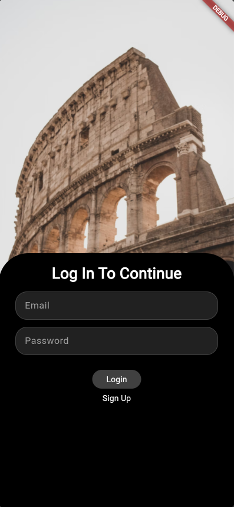
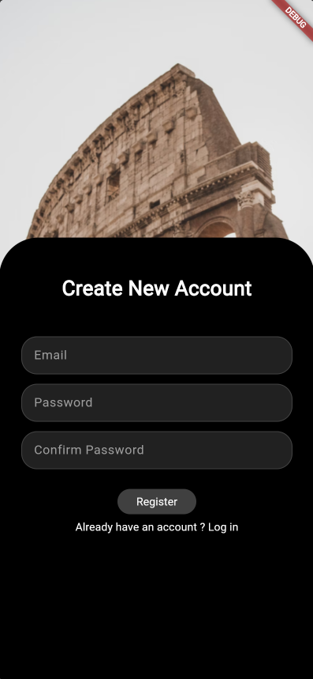
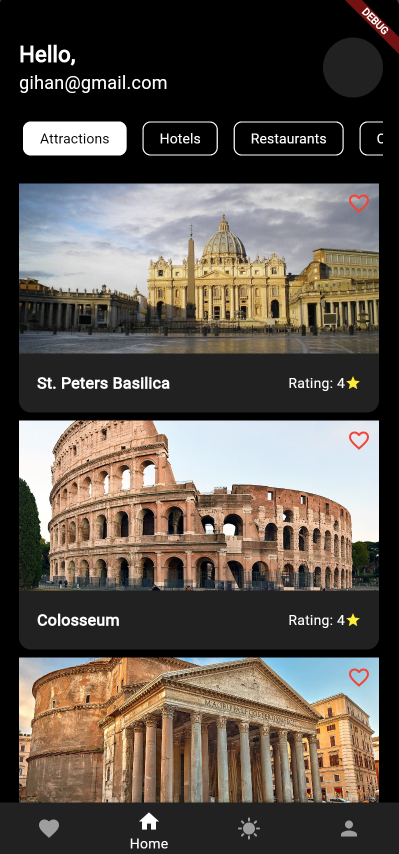
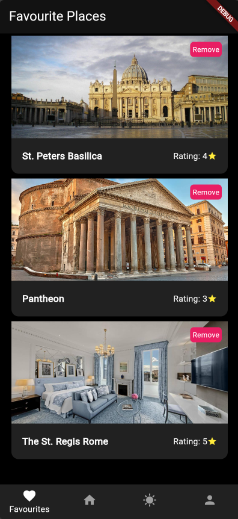
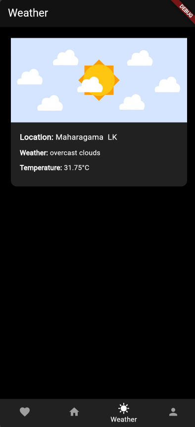
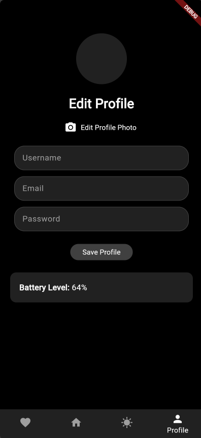

# RomaQuest

## Overview

RomaQuest is a Flutter travel app centered on exploring places in Rome. The current app includes Firebase authentication, curated place listings, favorites saved locally, location-based weather, and a profile screen with camera and battery integrations.

## Environment

- **Flutter SDK**: 3.44.4
- **Dart SDK**: 3.12.2

## Setup

1. Clone the repository:
   ```bash
   git clone <your-repo-url>
   ```
2. Move into the project directory:
   ```bash
   cd RomaQuest-Flutter-Travel-App
   ```
3. Get dependencies:
   ```bash
   flutter pub get
   ```
4. Run the app:
   ```bash
   flutter run
   ```

## Current Features

- Firebase email/password registration and login
- Welcome flow with auth state check
- Rome place browsing by category
- Place detail pages with ratings, hours, and descriptions
- Favorite places saved with `SharedPreferences`
- Weather lookup using device location and OpenWeatherMap
- Profile photo capture with the device camera
- Battery level display on the profile screen

## Tech Stack

- Flutter
- Firebase Authentication
- Shared Preferences
- OpenWeatherMap API
- Geolocator and permission handling
- Image Picker
- Battery Plus

## Notes

- Firebase configuration is already committed for the current project setup.
- Weather data requires location permission and network access.
- The app includes Android, iOS, web, macOS, Linux, and Windows platform folders.

## Screenshots

<br>
<br>
<br>
<br>
<br>
<br>
<br>

