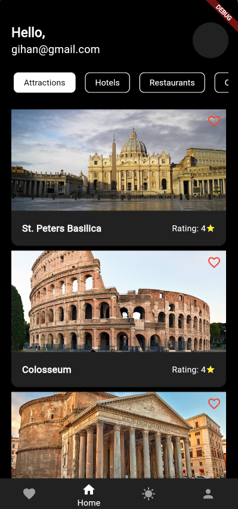

# RomaQuest Travel App

## Project Description

RomaQuest is a travel app developed with Flutter, designed to immerse users in the captivating allure of Rome, the Eternal City. With an intuitive interface and seamless navigation, this app brings the ancient wonders and modern delights of Rome to your fingertips.

## Installation Instructions

1. **Clone the Repository**:
   ```bash
   git clone https://github.com/yourusername/romaquest-travel-app.git

1. **Navigate to the Project Directory**:
   ```bash
   cd romaquest-travel-app
   
3.  **Install Dependencies**:
    ```bash
    flutter pub get

5.  **Run the App**:
    ```bash
    flutter run

## Usage

1. **Launch the App**: Follow the installation instructions to set up the app locally.
2. **Explore Rome**: Navigate through the app to explore various places, check the weather, and save your favorite locations.
3. **Use Features**: Utilize features like camera access to capture images, geolocation for location-based services, and check battery status.

## Features
- **User Authentication**: Registration and login via Firebase.
- **Weather Information**: Fetches real-time weather data using the OpenWeatherMap API.
- **Offline Content**: Displays relevant content even when the device is offline.
- **Favorite Locations**: Save favorite places using shared preferences.
- **Favorites Display**: View saved favorite locations on a dedicated screen.
- **Place Details**: Explore detailed information about various places in Rome.
- **Responsive Layouts**: The app adjusts to different screen sizes and orientations.
- **Camera Integration**: Capture images using the device's camera.
- **Geolocation**: Get the current location of the device.
- **Battery Status**: Monitor the device's battery percentage.

## Technologies Used
- **Flutter**: For building the cross-platform mobile application.
- **Firebase Authentication**: For user authentication and registration.
- **OpenWeatherMap API**: For fetching weather data.
- **Shared Preferences**: For storing and retrieving favorite locations.
- **JSON**: For handling data within the app.
- **Device Sensors**: Accessing the camera, geolocation, and battery status.

## Requirements
- **Flutter SDK**: Version 2.0 or higher.
- **Dart SDK**: Version 2.12 or higher.
- **Android Studio / Xcode**: For running the app on Android or iOS devices.
- **An Internet Connection**: Required for fetching weather data and using Firebase services.

## Screenshots
<br>
<br>
<br>
<br>
<br>
<br>
<br>


